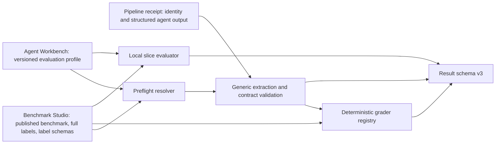

# Schema-Driven Evaluation And Scoring

**Status:** Implemented

Implementation completed across Benchmark Studio and Agent Workbench. The
durable runtime rules now live in `.agents/skills/agent-eval-builder/SKILL.md`;
this document remains the feature rationale and implementation record.

**Backlog feature:** `docs/development-backlog/features.md` → Schema-Driven
Evaluation And Scoring

## Outcome

Replace the Spirax-specific evaluation assumptions in
`src/evals/eval_orchestration.py` with a schema-driven system that can evaluate
any project-owned agent output against selected fields from an immutable,
published Benchmark Studio benchmark.

The finished system does:

- retain Benchmark Studio as the source of truth for all published labels and
  their schema;
- allow Agent Workbench to select a subset of benchmark labels for grading;
- allow the agent output contract to contain additional ungraded fields;
- map agent output paths to benchmark label paths without requiring matching
  names or shapes;
- grade JSON scalar values with configured deterministic graders;
- support required, optional, and conditionally applicable outputs;
- define benchmark slices locally in Agent Workbench;
- report accuracy only across valid, successfully scored runs;
- report execution and output-contract failures separately from accuracy; and
- write a versioned result document suitable for both human tooling and Codex.

## Non-Goals

This feature does not include:

- AI or nondeterministic graders;
- grading arbitrary nested objects or collections in MVP;
- changing or writing benchmark labels from Agent Workbench;
- defining benchmark slices in Benchmark Studio;
- the interactive result-inspection application;
- cross-run experiment comparison UI;
- agent-version creation; or
- portable agent packaging.

The result contract must nevertheless carry the identities and artifacts those
later features need.

## Decisions

### Benchmark truth and evaluation policy are separate

Benchmark Studio owns the immutable published label payload and the label
schema that gives those values meaning. This includes fields that are useful
for review but are not graded, such as free-text notes.

Agent Workbench owns a versioned **evaluation profile** that describes how a
particular agent output contract is evaluated:

- which benchmark fields are grading targets;
- where the corresponding values appear in the agent output;
- which deterministic grader and normalization policy apply;
- which agent-only fields must be present and structurally valid;
- when a field is applicable; and
- which local benchmark slices should be reported.

The evaluation profile is a projection over immutable benchmark truth, not a
second copy of the benchmark schema.

### Agent and benchmark fields need not match one-to-one

For a given evaluation profile:

- benchmark fields not selected by the profile remain available for
  inspection and slicing but are not graded;
- an agent may output only a subset of the benchmark labels;
- agent fields without a benchmark target may still be contract-validated and
  preserved in results; and
- field names and nesting may differ because the profile maps paths explicitly.

### Accuracy and reliability remain separate

Accuracy measures only valid runs for which every applicable grader completed.
Missing output, malformed output, partial output, identity mismatch, pipeline
failure, provider failure, timeout, cancellation, and grader failure do not
enter an accuracy denominator.

Those outcomes remain first-class results under reliability and scoring
coverage, with their raw/partial outputs and debugging evidence preserved.

For a valid scored run:

- **field correctness** is the configured grader result for one applicable
  benchmark target; and
- **complete evaluation correctness** is true only when every applicable
  graded field is correct.

Output-contract validity must not be named or presented as accuracy. A valid
but incorrect output is a reliable run and an inaccurate run.

## Superseded Current-State Gaps

The pre-implementation system provided useful foundations but was coupled to
the current use case in the following ways. These gaps are retained here as the
historical problem statement and are closed by the implementation below:

- `_STRUCTURED_OUTPUT_SPECS` hard-codes `classification` and `root_cause`;
- receipt extraction only accepts non-empty strings;
- benchmark loading filters `approved_label_payload` through the active
  `use_case_configs.eval_label_fields` list and discards other labels;
- exact string equality is embedded directly in orchestration;
- summary views contain Spirax-specific classification and root-cause logic;
- `EvalAttempt` treats output-contract validity as the same state as execution
  success and cannot represent a completed pipeline with partially extracted
  output cleanly;
- failed attempts cannot retain structured field observations;
- no project-owned evaluation-profile contract exists; and
- no reusable slice definition/evaluation exists.

Repeated execution, concurrency, benchmark identity, frozen evidence, failure
classification, timing, confidence aggregation, and immutable JSON writing
should be retained.

## Solution Architecture



The flow has two phases:

1. **Preflight:** resolve and validate the published benchmark, immutable label
   schemas, evaluation profile, pipeline output paths, graders, and slices
   before running any model calls.
2. **Execution and scoring:** execute each planned attempt, validate identity,
   extract the configured agent output, classify contract validity, grade valid
   attempts, assign slices, aggregate metrics, and persist result schema v3.

## Cross-Product Published Benchmark Contract

Agent Workbench currently receives label names from the active Benchmark
Studio project configuration, not the complete immutable label context used by
each published example. A small Benchmark Studio read-contract change is a
prerequisite.

### Required Benchmark Studio response

For a selected published benchmark version, expose:

- the complete `approved_label_payload` for every example without filtering it
  through `eval_label_fields`;
- the `label_schema_version_id` frozen on every benchmark-version example;
- every referenced immutable label schema as a de-duplicated version-level
  collection containing:
  - schema ID;
  - schema key and human version;
  - complete schema JSON; and
  - SHA-256 of canonical schema JSON;
- the existing `eval_label_fields` as an informational Benchmark Studio
  default/hint, not as the Agent Workbench scoring contract; and
- a published-contract schema version.

The existing benchmark version ID, version number, source-state hash, example
identity, source snapshot identity, and raw artifact manifest remain required.

### Agent Workbench benchmark models

Evolve `src/benchmarks/models.py` conceptually to include:

```python
JsonScalar = str | int | float | bool | None

class PublishedLabelSchema(BaseModel):
    schema_version_id: str
    schema_key: str
    version: str
    schema: dict[str, Any]
    content_sha256: str

class BenchmarkExample(BaseModel):
    # Existing identity/evidence fields remain.
    approved_label_payload: dict[str, Any]
    label_schema_version_id: str

class BenchmarkVersion(BaseModel):
    # Existing version fields remain.
    published_contract_schema_version: int
    eval_label_field_hints: tuple[str, ...]
    label_schemas: tuple[PublishedLabelSchema, ...]
```

Do not coerce approved label values to strings during repository loading.

The loader must validate that every example references a supplied label schema
and that every schema hash matches its canonical JSON. Multiple schema versions
within one published benchmark are permitted, but the evaluation-profile
preflight must prove it can resolve every selected example consistently.

## Agent Workbench Evaluation Profile

### Location and identity

Store project-owned profiles under:

```text
evaluation_configs/
  <profile-id>.eval.yaml
```

Every profile has a human version and a canonical content hash. Eval results
record both. Changing field mappings, graders, normalization, applicability,
or slices creates a new profile version; it must never silently alter the
meaning of an existing result.

Suggested top-level contract:

```yaml
schema_version: 1
profile_id: spirax-failure-evaluation
profile_version: 1

benchmark_compatibility:
  schema_keys:
    - spirax-steam-trap-label

output_fields: []
slices: []
```

### Output-field contract

Each output field describes extraction and contract validation. A field becomes
graded only when it declares a benchmark target and grader.

```yaml
output_fields:
  - key: classification
    actual:
      receipt_metadata_path: [classification, value]
      type: string
    presence: required
    confidence:
      receipt_metadata_path: [classification, confidence]
      values: [High, Low]
    evaluation:
      benchmark_label_path: [classification]
      grader:
        id: core.exact
        version: 1

  - key: root_cause
    actual:
      receipt_metadata_path: [root_cause, value]
      type: string
    presence: required
    confidence:
      receipt_metadata_path: [root_cause, confidence]
      values: [High, Low]
    evaluation:
      benchmark_label_path: [root_cause]
      grader:
        id: core.normalized_string
        version: 1
        config:
          trim: true
          casefold: false
          collapse_whitespace: true

  - key: recommended_action
    actual:
      receipt_metadata_path: [recommended_action]
      type: string
    presence: required
```

In this example, `recommended_action` is part of the agent's downstream output
contract but has no matching benchmark label. It must be valid for the run to
be valid, is retained for inspection, and does not contribute to accuracy.

Benchmark fields such as `review_notes` remain in the full published label
payload but are not graded unless a profile explicitly targets them.

### Supported MVP scalar types

Support JSON scalar types:

- `string`
- `integer`
- `number`
- `boolean`
- `null`

Paths may traverse nested mappings, but the terminal value must be a scalar in
MVP. A type mismatch is an output-contract failure, not an incorrect graded
value.

### Presence and conditional applicability

Support:

- `required`: must be present and type-valid;
- `optional`: may be absent; when present it must be type-valid; and
- `conditional`: required only when a declarative predicate is true.

Use one small, non-executable predicate language shared by conditional fields
and slices. Do not evaluate arbitrary Python or template expressions from YAML.

Predicates may read:

- `benchmark.labels`;
- `benchmark.example_metadata`;
- `benchmark.unit_id` and `benchmark.decision_timestamp`; and
- already extracted `agent.outputs` when output-dependent validation is
  genuinely necessary.

MVP operators are `equals`, `not_equals`, `in`, `exists`, `and`, `or`, and
`not`. Example:

```yaml
presence:
  conditional:
    equals:
      path: [benchmark, labels, classification]
      value: Failure
```

When a graded field is not applicable, record it as `not_applicable` and omit
it from field and complete-evaluation accuracy denominators.

## Deterministic Grader Contract

### Interface

Move comparison out of orchestration and behind a generic grader protocol in
`agent-dev-eval-core/evaluation`:

```python
class DeterministicGrader(Protocol):
    grader_id: str
    grader_version: int

    def grade(
        self,
        *,
        expected: JsonScalar,
        actual: JsonScalar,
        config: Mapping[str, Any],
    ) -> FieldGrade: ...

class FieldGrade(BaseModel):
    correct: bool
    expected: JsonScalar
    actual: JsonScalar
    normalized_expected: JsonScalar | None = None
    normalized_actual: JsonScalar | None = None
    details: dict[str, Any] = {}
```

Graders must be deterministic, side-effect-free, JSON-serializable, and fail
closed on invalid configuration. A grader exception is a `grader_error`; it is
not an inaccurate agent answer and excludes that attempt from accuracy.

### Built-in MVP graders

Provide:

- `core.exact@1`: JSON type and value equality;
- `core.normalized_string@1`: explicitly configured trimming, case folding,
  whitespace collapsing, and optional alias mapping; and
- `core.numeric_tolerance@1`: numeric comparison with explicitly configured
  absolute and/or relative tolerance.

Boolean values use exact comparison. `null` may be compared exactly when the
profile and published schema allow it.

No grader may apply hidden normalization. The result must record grader ID,
version, effective configuration, and normalized values when normalization was
used.

### Project-owned graders

Allow use-case projects to register additional deterministic graders by stable
ID and integer version under `src/evals/graders/`. Registration is explicit;
YAML must not import an arbitrary module path. The preflight resolver fails if
a grader is missing, duplicated, or incompatible with the field types.

Generic protocols, registry mechanics, and built-ins belong in
`agent-dev-eval-core`. Use-case-specific grader behavior belongs in the root
project.

## Output Contract And Attempt State Model

Replace the current single success/failure interpretation with orthogonal
states:

### Execution status

- `completed`: the pipeline produced a terminal receipt;
- `failed`: pipeline/provider/transport/timeout/executor failure; or
- `cancelled`.

### Output-contract status

- `valid`: identity and every applicable required output are present and
  type-valid;
- `invalid`: identity mismatch, missing required output, malformed value, or
  partial required output; or
- `not_produced`: execution never produced a usable act receipt.

### Scoring status

- `scored`: all applicable deterministic graders completed;
- `not_scored`: execution or output contract was invalid;
- `grader_error`: the harness could not grade a valid output; or
- `no_applicable_targets`: valid output with no graded fields for that example.

Preserve partial extraction, raw receipt output, all validation violations,
pipeline/stage correlation IDs, bounded exception details, timings, and
attempt identity regardless of terminal state.

Use normalized failure categories at minimum:

- `provider_error`
- `transport_error`
- `timeout`
- `pipeline_error`
- `receipt_identity_error`
- `output_missing`
- `output_malformed`
- `output_partial`
- `grader_error`
- `executor_error`
- `cancelled`
- `unknown`

An attempt contributes to accuracy only when output-contract status is `valid`
and scoring status is `scored`.

## Local Benchmark Slices

Slices are versioned evaluation-profile definitions evaluated against the
immutable example. They do not alter Benchmark Studio or benchmark membership.
An example may belong to zero, one, or many slices.

Example:

```yaml
slices:
  - key: expected-failure
    label: Expected Failure
    where:
      equals:
        path: [benchmark, labels, classification]
        value: Failure

  - key: high-priority-assets
    label: High Priority Assets
    where:
      in:
        path: [benchmark, example_metadata, asset_priority]
        values: [critical, high]
```

Slice predicates may use benchmark labels, example metadata, identity, and
decision timestamp. Do not define slices from agent outputs in MVP; doing so
would make slice membership vary by model result and undermine comparisons.

Preflight reports the number of selected examples in each slice, including
empty slices. Empty slices are retained in the summary with null accuracy and
zero counts.

CLI-selected example IDs, unit IDs, and ad hoc filters determine execution
scope. Named slices determine reporting groups. Selecting a named slice as an
execution scope may be added by resolving its membership before execution.

## Preflight Validation

Before the first pipeline or model call:

1. Load the exact published benchmark version.
2. Verify benchmark source-state and label-schema hashes.
3. Load and canonicalize the evaluation profile.
4. Resolve every output path, expected benchmark path, grader, confidence
   policy, conditional predicate, and slice predicate.
5. Validate field/grader type compatibility.
6. Validate every selected example against its frozen label schema.
7. Ensure every applicable graded target has an expected value.
8. Ensure multiple label-schema versions are compatible with the selected
   profile.
9. Compute evaluation-profile and resolved-scoring-contract hashes.
10. Produce a concise preflight summary and fail before execution on any
    incompatibility.

This prevents expensive runs whose outputs cannot be interpreted or compared.

## Metrics

### Accuracy

Accuracy is calculated only from attempts with:

```text
output_contract_status = valid
and scoring_status = scored
```

Report count-bearing metrics so every ratio has an auditable denominator:

- complete evaluation accuracy;
- accuracy by graded field;
- field accuracy by expected value;
- field accuracy by configured confidence;
- complete and field accuracy by named slice; and
- the same metric bundle for any requested cross-result dimensions.

Complete evaluation correctness is the logical `and` of all applicable field
grades. An example with no applicable grading targets is excluded from accuracy
and reported through scoring coverage.

### Reliability and scoring coverage

Report separately:

- planned, recorded, completed, failed, and cancelled attempts;
- valid, invalid, and not-produced output contracts;
- scored, not-scored, grader-error, and no-target attempts;
- counts by normalized failure category;
- output-contract validity rate (`valid / planned`);
- scoring coverage (`scored / planned`); and
- grader completion rate (`scored / valid attempts with applicable targets`).

Failures never reduce valid-run accuracy. The counts and coverage rates make it
impossible to present high accuracy while hiding poor execution reliability.

### Grouping dimensions

Persist stable dimensions rather than hard-coding a separate summary tree for
every future comparison:

- benchmark key/version/source-state hash;
- evaluation profile ID/version/hash;
- agent version when available;
- pipeline configuration identity/hash;
- model/provider/reasoning configuration;
- grader-set hash;
- named slice memberships; and
- project-declared relevant configuration dimensions.

The single-run summary groups by field, expected label, confidence, and slice.
A generic result aggregator can apply the same metrics across multiple result
documents grouped by model, agent version, or configuration without changing
the scoring model.

## Evaluation Result Schema Version 3

Retain the established top-level key order:

1. `summary`
2. `run_config`
3. `selected_example_ids`
4. `results`

### `summary`

```json
{
  "accuracy": {
    "complete_evaluation": {
      "accuracy": 0.82,
      "correct_runs": 82,
      "evaluated_runs": 100
    },
    "by_field": {},
    "by_slice": {}
  },
  "reliability": {
    "planned_runs": 110,
    "recorded_runs": 110,
    "execution_status_counts": {},
    "output_contract_status_counts": {},
    "failures_by_type": {},
    "output_contract_validity_rate": 0.927
  },
  "scoring_coverage": {
    "status_counts": {},
    "scored_runs": 100,
    "planned_runs": 110,
    "coverage": 0.909
  },
  "performance": {}
}
```

The example demonstrates that 82% accuracy is computed across 100 valid,
scored runs, while reliability and coverage separately explain the ten runs
that did not reach scoring.

### `run_config`

Add to the existing benchmark, pipeline, model, runtime, repetition, timeout,
and transport policy fields:

- `eval_result_schema_version: 3`;
- published-contract schema version;
- referenced label-schema identities and hashes;
- evaluation profile ID, version, path, and content hash;
- resolved scoring-contract hash;
- grader IDs, versions, and effective configurations;
- slice definitions and slice-definition hash;
- agent-version identity when available; and
- project-declared grouping dimensions.

### Per-example result

Persist:

- existing example/evidence identities;
- complete `benchmark_labels`, including ungraded fields;
- label-schema version identity;
- named slice memberships; and
- repeated attempts.

### Per-attempt result

Persist:

- run index and attempt identity;
- execution, output-contract, and scoring statuses;
- normalized failure category and debugging details;
- complete extracted agent outputs, including ungraded fields;
- raw output artifacts needed for debugging;
- contract violations and partial extraction;
- per-field applicability, expected value, actual value, confidence, grader
  identity/configuration, normalized values, and correctness;
- complete evaluation correctness when scored;
- timing and stage timing; and
- correlation IDs and bounded exception details for failures.

Sensitive or large prompt/evidence artifacts can remain content-addressed
references; this schema must preserve their identities for the later inspection
feature.

## Code Ownership And Expected Changes

### Benchmark Studio repository

- Extend the published benchmark read contract to return full label payloads,
  frozen label-schema references, and de-duplicated schema documents/hashes.
- Version that response contract.
- Preserve existing read-only authorization and published immutability.

### `src/benchmarks/`

- Model full label payloads without string coercion.
- Add immutable published label-schema models.
- Validate schema references and hashes during benchmark loading.
- Update PostgreSQL and hosted Container App repository adapters together.

### `agent-dev-eval-core/evaluation/`

- Generalize actual and expected values to JSON scalars.
- Introduce orthogonal execution, output-contract, and scoring statuses.
- Add deterministic grader protocol, registry, built-ins, and typed grades.
- Generalize structured extraction to configured scalar types and paths.
- Add generic count-bearing complete/field/group metric primitives.
- Preserve framework independence from `src` and use-case models.

### `src/evals/`

- Add evaluation-profile Pydantic models, YAML loading, canonical hashing, and
  preflight resolution.
- Register project-owned graders explicitly.
- Implement the safe predicate engine and local slice evaluation.
- Resolve receipt output paths from the profile instead of
  `_STRUCTURED_OUTPUT_SPECS`.
- Replace embedded exact comparison and Spirax summary branches with resolved
  graders and generic aggregation.
- Write result schema v3.

### Pipelines and receipts

- Retain benchmark/example identity in act-stage metadata.
- Continue to expose the final structured agent output through act metadata.
- Remove the requirement that every pipeline use metadata keys named
  `classification` and `root_cause`; the evaluation profile resolves paths.

No `mi-core` change is expected unless current receipt serialization cannot
preserve the required JSON scalar output or debugging artifacts.

## Completed Implementation Sequence

All seven phases below are complete. Historical result schema v2 files remain
unchanged; active execution and the refactored Spirax example use only the new
receipt, profile, and schema v3 contracts.

Each phase should receive its own task breakdown in this document or a linked
child plan when active.

### Phase 1: Freeze contracts and fixtures

- Finalize Benchmark Studio published-contract v2 and evaluation-profile v1.
- Create representative fixtures covering full labels, notes, multiple scalar
  types, conditional fields, multiple schema references, invalid output, and
  failed execution.
- Finalize result schema v3 examples before implementation.

### Phase 2: Publish immutable label context

- Implement Benchmark Studio read-contract changes.
- Update both Agent Workbench repository adapters and domain models.
- Prove that existing benchmark/evidence identity and checksum behavior remains
  unchanged.

### Phase 3: Evaluation-profile and preflight

- Implement profile models, safe predicate validation, registry resolution,
  schema compatibility, and canonical hashing.
- Add a Spirax profile that reproduces existing `classification` and
  `root_cause` behavior.
- Add a non-interactive preflight command or eval dry-run option.

### Phase 4: Generic extraction and deterministic grading

- Evolve core attempt and field-grade models.
- Implement scalar extraction, conditional applicability, built-in graders,
  and explicit project-grader registration.
- Preserve raw and partial output on every failure path.

### Phase 5: Generic metrics and slices

- Implement complete and field metrics across scored runs only.
- Add confidence and expected-value views generically.
- Add local slice membership and slice metrics.
- Add reliability and scoring-coverage summaries.

### Phase 6: Result schema v3 and CLI integration

- Persist all resolved identities, statuses, field grades, slices, and debug
  evidence.
- Update the eval CLI to require or resolve an explicit evaluation profile.
- Update `EvalRunbook.md` and repo skills after behavior is stable.

### Phase 7: Compatibility and migration

- Keep result readers able to identify schema v2 and v3 explicitly.
- Do not rewrite historical v2 files.
- Provide a narrow v2 adapter for future result-inspection tooling if needed;
  absent fields remain unknown rather than inferred.
- Remove Spirax-specific scoring branches only after the Spirax v1 profile
  produces equivalent valid-run metrics on fixed fixtures.

## Testing Strategy

### Benchmark contract

- full label payloads, including ungraded notes, survive loading unchanged;
- each example resolves its immutable label schema;
- missing/incorrect schema hashes fail before execution;
- multiple schema versions are handled or rejected deterministically; and
- hosted and direct repository adapters return equivalent models.

### Evaluation profile

- duplicate keys, bad paths, unsupported types/operators, missing graders, and
  invalid grader configs fail preflight;
- subset and superset output contracts resolve correctly;
- conditional and optional fields produce correct applicability;
- canonical hashes are stable across inconsequential YAML formatting changes;
  and
- slices have deterministic membership and retain empty groups.

### Grading

- exact comparison is type-sensitive;
- every normalization option is explicit and recorded;
- numeric tolerance covers boundary, absolute, relative, integer, and float
  cases;
- custom grader registration is explicit and versioned;
- grader exceptions become `grader_error`; and
- ungraded agent outputs never affect accuracy.

### Attempt outcomes

- valid/correct and valid/incorrect runs both count in accuracy;
- missing, malformed, partial, identity-mismatched, failed, timed-out, and
  cancelled runs do not count in accuracy;
- failed and invalid attempts retain partial/raw outputs and debug evidence;
- reliability and scoring coverage include every planned attempt; and
- no-target examples are visible but excluded from accuracy.

### Metrics and results

- field and complete correctness denominators use scored runs only;
- conditional non-applicable fields do not enter denominators;
- grouped metrics match direct recomputation for label, confidence, and slice;
- all ratios include numerator/denominator counts;
- schema v3 maintains required top-level ordering and benchmark identity; and
- v2 fixtures remain readable by version-aware downstream tooling.

### End-to-end

- the current Spirax pipeline evaluated through its profile reproduces current
  accuracy for valid runs;
- injected failures reduce reliability/coverage without changing valid-run
  accuracy;
- a second fixture with different field names and scalar types requires no
  orchestration code changes; and
- threaded/process repeated execution produces equivalent scoring results.

## Acceptance Criteria

- No active scoring path contains hard-coded `classification`, `root_cause`,
  `Failure`, or `Healthy` semantics.
- An FDE can add or change an evaluation field, mapping, grader, condition, or
  slice through a versioned project profile plus an explicitly registered
  project grader when necessary.
- Benchmark Studio full labels and frozen schema identity are present in every
  result without being treated as automatically graded fields.
- Agent output contracts may be subsets or supersets of benchmark labels.
- Exact, normalized-string, and numeric-tolerance graders work for supported
  JSON scalars.
- Missing, malformed, partial, operationally failed, and grader-failed attempts
  are preserved and excluded from accuracy.
- Accuracy, reliability, and scoring coverage expose their counts and cannot be
  conflated.
- Conditional applicability and local slices work without arbitrary code
  execution from configuration.
- Result schema v3 is documented, versioned, deterministic, and consumable by
  both Python tooling and Codex.
- Existing immutable benchmark/evidence provenance remains intact.

## Risks And Mitigations

### Evaluation semantics can drift independently of benchmark truth

Mitigation: version and hash every evaluation profile and resolved grader set;
persist both in results and later agent versions.

### Flexible YAML can become an unsafe programming language

Mitigation: support a deliberately small declarative predicate set and an
explicit grader registry. Never execute arbitrary expressions or imports from
profile files.

### High accuracy can hide low reliability

Mitigation: keep valid-run accuracy separate as requested, but display planned,
valid, scored, and failed counts plus output-validity and scoring-coverage rates
alongside every accuracy summary.

### Multiple historical label schemas can make one metric ambiguous

Mitigation: preflight compatibility across selected examples, persist each
example's schema identity, and reject a run when one profile cannot interpret
all selected versions consistently.

### Result schema growth can make files difficult to inspect

Mitigation: keep summaries compact and count-bearing; preserve large evidence
and prompt artifacts by stable content-addressed reference for the dedicated
inspection feature.
