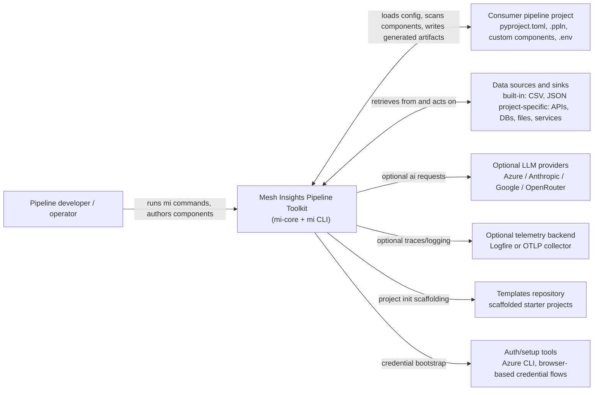
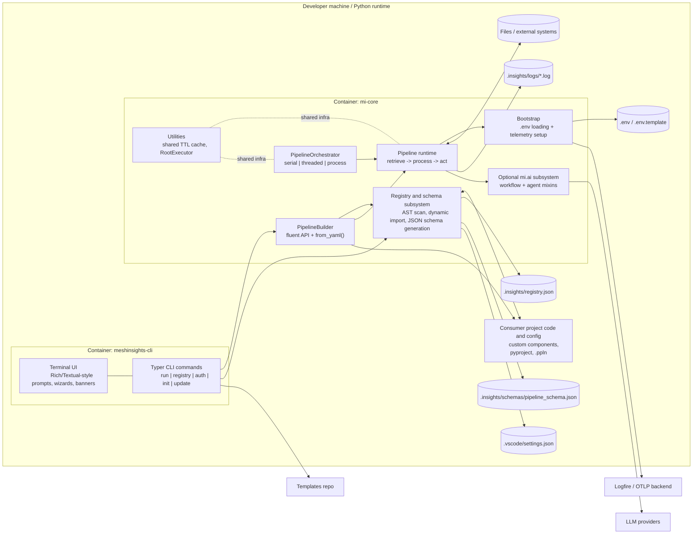
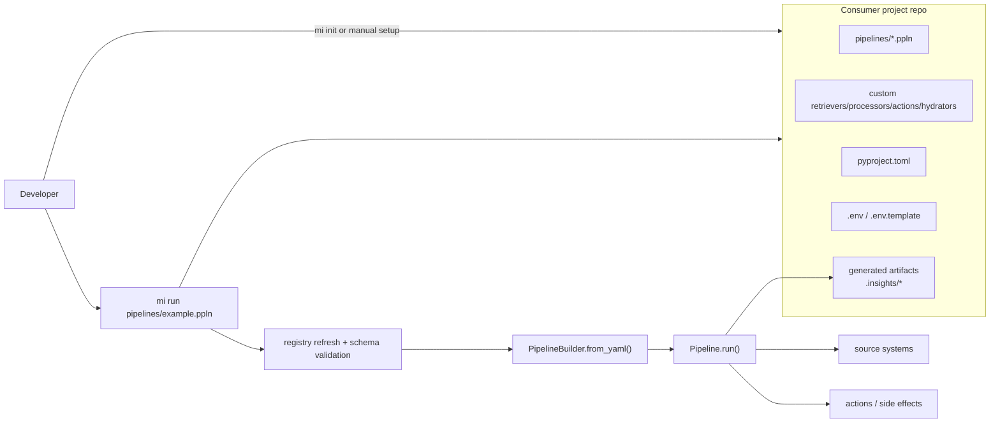

# Architecture Overview

`mesh.insights.core` is a framework repo, not a concrete pipeline project. It
ships the reusable runtime (`mi-core`) and the terminal CLI (`meshinsights-cli`)
that downstream projects use to define, validate, and run pipelines. Concrete
starter implementations now live in the companion templates repository:
`https://github.com/Mesh-Systems-Eng/mesh.insights.templates`.

## System Context

## Containers And Subsystems

## Major Subsystems

- **`meshinsights-cli`**: the user-facing entry point. It runs pipelines,
  manages the registry, helps configure credentials, scaffolds new consumer
  projects from templates, and updates the installed CLI.
- **Registry and schema generation**: scans consumer-project Python modules for
  classes that inherit from framework base types, writes `.insights/registry.json`,
  generates `.ppln` JSON schema, and wires VS Code YAML settings.
- **PipelineBuilder and YAML loading**: converts declarative `.ppln` files into
  instantiated retrievers, hydrators, processors, actions, and typed data
  objects.
- **Pipeline runtime**: coordinates the retrieve, process, and act stages,
  manages receipts, logs, error behavior, and stage transitions through
  hydrators.
- **PipelineOrchestrator**: runs the same pipeline template across many items
  with serial, threaded, or subprocess execution models and propagates trace
  context into worker processes.
- **`mi.ai`**: optional AI extensions for processors. It supports one-shot
  structured workflows and tool-using agents through a lazily resolved backend
  built around `pydantic-ai`.
- **Utilities and observability**: shared TTL cache, root-thread execution
  helper for unsafe libraries, `.env` bootstrap, and telemetry bootstrap to
  Logfire or OTLP.

## Typical Consuming Project

Concrete examples belong in the templates repo, but a typical consuming project
that uses this framework looks like this:

Typical project responsibilities:

- own the domain-specific components and data contracts
- own the `.ppln` pipeline definitions and `.env` configuration
- treat `.insights/` and `.vscode/settings.json` as generated support artifacts
- use this repo for the framework runtime, not as the source of example project
  behavior

## Notes

- This repo currently ships built-in file retrievers for CSV and JSON, but most
  real integrations are expected to come from consumer projects.
- The framework does not include a built-in scheduler or durable message broker.
  Pipelines are typically invoked by the CLI or by a host application.
- `RootExecutor` uses in-memory thread and process queues for coordination, but
  those are framework internals rather than an external queueing subsystem.

## See Also

- [Getting Started](getting-started.md) — how to structure a consuming project
- [Pipeline Builder](pipeline-builder.md) — fluent and YAML-driven assembly
- [Orchestrator](orchestrator.md) — parallel execution models
- [Registry](registry.md) — component discovery and schema generation
